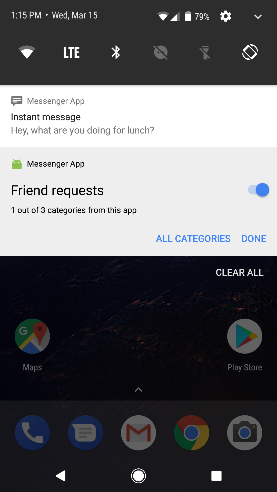

Android NotificationChannels Sample
===================================

Demonstration of using channels to categorize notifications by topic. This feature was
            added in Android O, and allows users to have fine-grained control over their
            notification preferences.

Introduction
------------

Android O introduces notification channels to provide a unified system to help users
manage notifications. When you target Android O, you must implement one or more
notification channels to display notifications to your users.

You can create a notification channel for each distinct type of notification you need
to send. You can also create notification channels to reflect choices made by users of
your app. For example, you might setup separate notification channels for each
conversation group created by a user in a messaging app.

To create a channel, call `[NotificationManager.createNotificationChannels()][1]`. You
can then use `[Notification.Builder.setChannel()][2]` to assign your notification to that
channel.

Users can now manage most of the settings associated with notifications using a
consistent system UI. All notifications posted to a notification channel behave the
same. To access the settings screen, use the `ACTION_CHANNEL_NOTIFICATION_SETTINGS`
intent:

```
Intent intent = new Intent(Settings.ACTION_CHANNEL_NOTIFICATION_SETTINGS);
intent.putExtra(Settings.EXTRA_CHANNEL_ID, mChannel.getId());
intent.putExtra(Settings.EXTRA_APP_PACKAGE, getPackageName());
startActivity(intent);
```


[1]: https://developer.android.com/reference/android/app/NotificationManager.html#createNotificationChannels(java.util.List<android.app.NotificationChannel>)
[2]: https://android-dot-devsite.googleplex.com/reference/android/app/Notification.Builder.html#setChannel(java.lang.String)

Pre-requisites
--------------

- Android SDK 27
- Android Build Tools v27.0.2
- Android Support Repository

Screenshots
-------------

 

Getting Started
---------------

This sample uses the Gradle build system. To build this project, use the
"gradlew build" command or use "Import Project" in Android Studio.

Support
-------

- Google+ Community: https://plus.google.com/communities/105153134372062985968
- Stack Overflow: http://stackoverflow.com/questions/tagged/android

If you've found an error in this sample, please file an issue:
https://github.com/googlesamples/android-NotificationChannels

Patches are encouraged, and may be submitted by forking this project and
submitting a pull request through GitHub. Please see CONTRIBUTING.md for more details.

License
-------

Copyright 2017 The Android Open Source Project, Inc.

Licensed to the Apache Software Foundation (ASF) under one or more contributor
license agreements.  See the NOTICE file distributed with this work for
additional information regarding copyright ownership.  The ASF licenses this
file to you under the Apache License, Version 2.0 (the "License"); you may not
use this file except in compliance with the License.  You may obtain a copy of
the License at

http://www.apache.org/licenses/LICENSE-2.0

Unless required by applicable law or agreed to in writing, software
distributed under the License is distributed on an "AS IS" BASIS, WITHOUT
WARRANTIES OR CONDITIONS OF ANY KIND, either express or implied.  See the
License for the specific language governing permissions and limitations under
the License.
